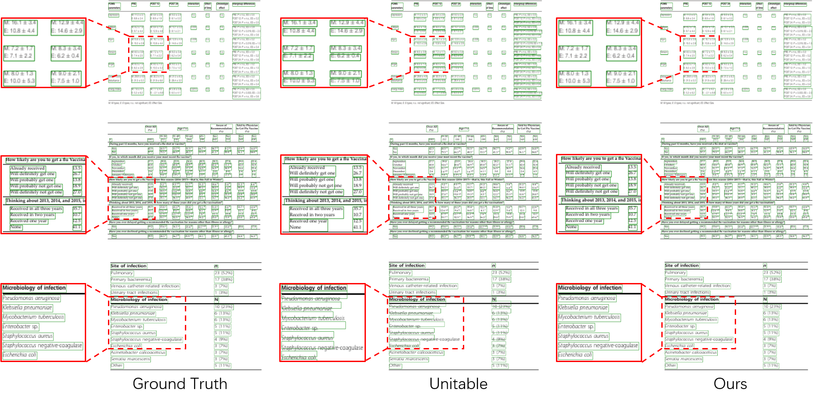
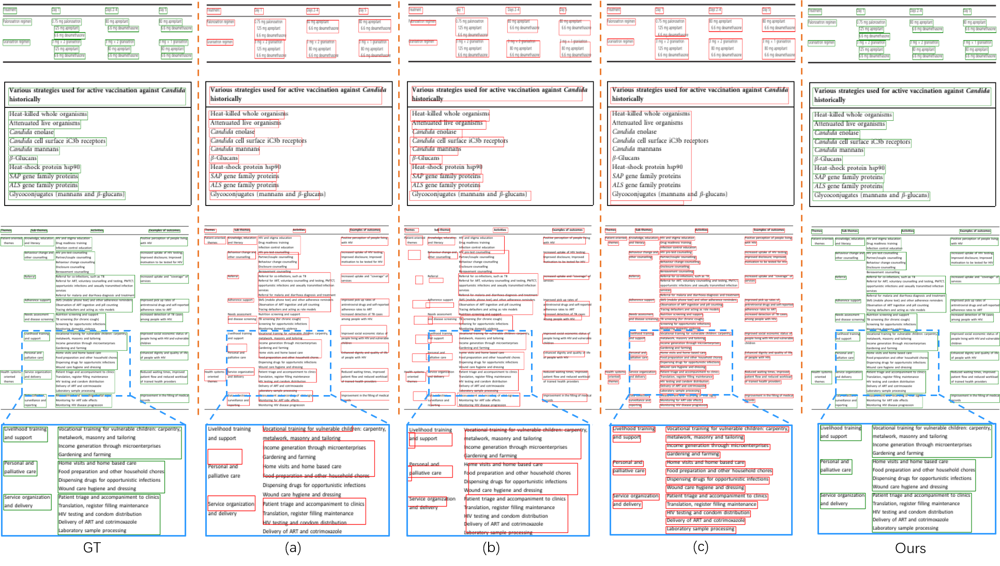
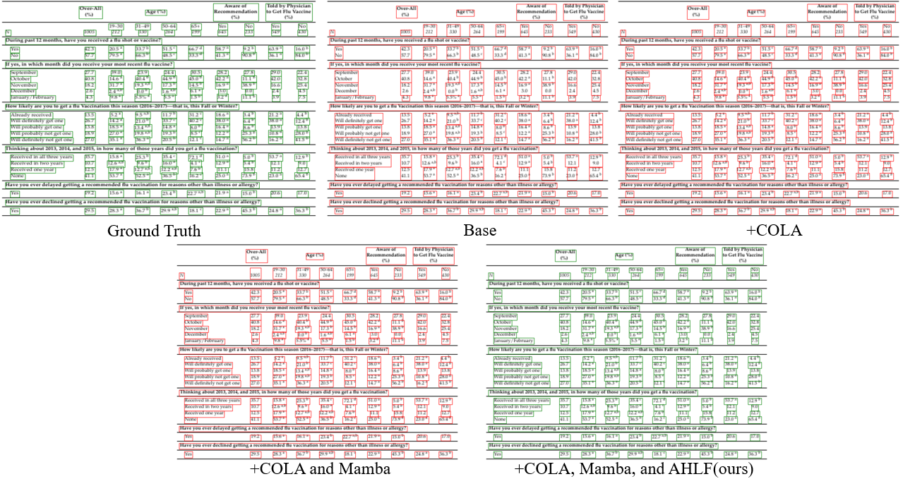

# A Financial Table Structure Recognition Method Based on Transformer with Attention Enhancement

The image shows the performance of ground truth, the Unitable method, and our approach in the cell border detection task on a subset of the PubTabNet dataset. The middle shows the problematic tables, the left side displays the corresponding ground truth, and the right side shows the detection results of our method. Specifically, Unitable failed to correctly merge the spanning cells in the first row of the table; it did not recognize the cells in the second row as independent rows; and it exhibited border drift issues in the third row of the table.
<p align="center"></p>

# Comparison Experiment
GT denotes the ground truth, a–c present the inference results of existing methods, a TableMaster, b SLANet, and c Unitable, followed by our  method’s test results.
<p align="center"></p>

# Ablation Study
The figure below shows examples of our ablation experiments. We separately add the collaborative attention module, the Mamba module, and the adaptive hybrid loss function to the base model, as illustrated in the figure.
<p align="center"></p>

# Installing
1. Set up virtual environment (unitable) by running `make .done_venv` in your terminal.
2. Download the corresponding mambaSSM and 1D convolution versions, then install them using pip.
3. Download all the model weights from [HuggingFace](https://huggingface.co/poloclub/UniTable/tree/main) by running `make .done_download_weights` in your terminal.

# Training
Our code is driven by [Makefile targets](https://www.gnu.org/software/make/manual/make.html) and configured by [Hydra](https://hydra.cc/docs/intro/). Experiment names are defined as `EXP_<name>` in [CONFIG.mk Sec. Experiments](CONFIG.mk). We have also provided how to launch the make target in the comment above each experiment.
## Dataset annotation format
We provide a tiny portion (20 samples) of PubTabNet as an example for a quick walk through of the training process. The dataset (tabular image and annotation) is available at [dataset/mini_pubtabnet](./dataset/mini_pubtabnet/). The annotation for all images are in [mini_pubtabnet_examples.jsonl](./dataset/mini_pubtabnet/mini_pubtabnet_examples.jsonl). Each line is a `json` object that corresponds to a `png` image with the following structure:

```python
"filename": "tabular image filename inside one of the 'train', 'val', or 'test'",
"split": "One of 'train', 'val', or 'test'",
"html": "table structure, cell content, and cell bbox",
    "cells": "Array with all cell content and bbox",
        "tokens": "Array with the content of the cell",
        "bbox": "The bounding bbox of the cell in [x1, y1, x2, y2] format. Only provided when cell is non-empty.",
    "structure": "Dict with table structure",
        "tokens": "Array with html tags that describe the table structure. '[]' represents non-empty cell",
```

If you want to train on your own dataset, please convert your dataset based on the provided format.
The five datasets we used in the paper are [PubTabNet](https://github.com/ibm-aur-nlp/PubTabNet), [SynthTabNet](https://github.com/IBM/SynthTabNet), [FinTabNet](https://developer.ibm.com/exchanges/data/all/fintabnet/), [ICDAR 2019 B2 Modern](https://github.com/cndplab-founder/ICDAR2019_cTDaR), and [PubTables-1M](https://huggingface.co/datasets/bsmock/pubtables-1m).
After downloading these datasets, please update the `root_dir` for each dataset under [configs/dataset/<name>](./configs/dataset/).

## Tracking your training progress
Please register [Weights & Biases account](https://wandb.ai/site) if you want to visualize training curves and reconstructed tables (for pretraining VQ-VAE only). An example of reconstructed tables by VQ-VAE:

<p align="center"></p>


## Finetuning
We present finetuning on the provided mini-PubTabNet. For more details on cross dataset finetuning, please check [CONFIG.mk](CONFIG.mk).

```bash
# table structure
make experiments/ssp_2m_mini_html_base/.done_finetune

# cell bbox
make experiments/ssp_2m_mini_bbox_base/.done_finetune

# cell content
make experiments/ssp_2m_mini_cell_base/.done_finetune
```

## Pretraining
We present training the VQ-VAE and pretraining the visual encoder on the provided mini-PubTabNet. For more details on cross dataset finetuning, please check [CONFIG.mk](CONFIG.mk).

### VQ-VAE
```bash
make experiments/vqvae_mini/.done_pretrain
```

### SSP visual encoder - Masked tabular image modeling (MTIM)
```bash
make experiments/mtim_mini_base/.done_pretrain
```

## Multi-GPU
The default setting is a single gpu, i.e., `NGPU := 1` in [Makefile](Makefile). To enable multi-GPU, please launch the above command with the following format: `CUDA_VISIBLE_DEVICES=0,1,2,3 make NGPU=4 experiment/<exp name>/.done_<training type>`.

## Citation
```bibtex

```

